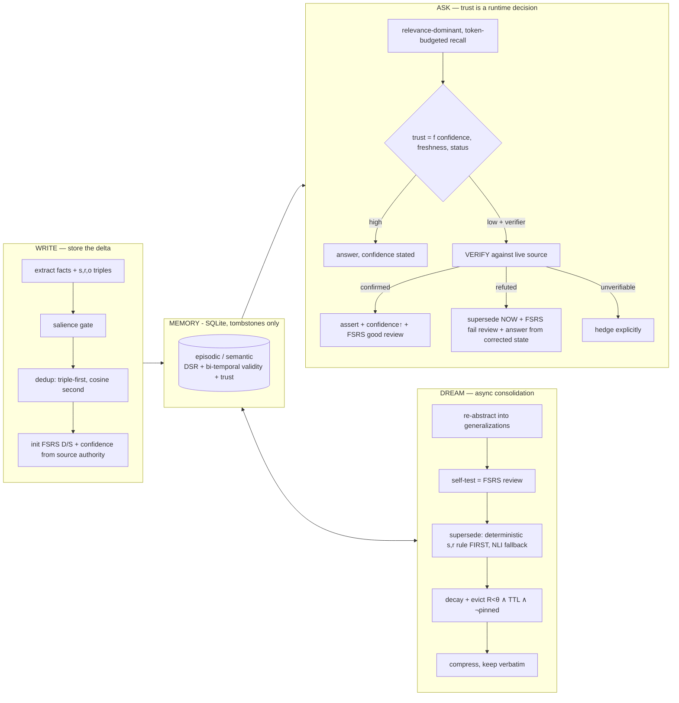

# Quên

> **Quên** *(sounds like **Qwen**; Vietnamese for "to forget")* — a Qwen-powered
> memory that knows what to forget — and how sure to sound.
>
> *Also: Quen is the protective shield sign in The Witcher — it shields your
> agent from stale memory.*

**Trust-calibrated forgetting: an agent memory that knows what to forget, says
how sure it is, and verifies before it asserts.**

Built for the **Qwen Cloud Global AI Hackathon · Track 1: MemoryAgent**.
All LLM and embedding calls run on **Qwen via Alibaba Cloud DashScope**
([`src/quen/alibaba_client.py`](src/quen/alibaba_client.py) is the single
network path — no other provider, ever).

> ⚠️ **Not affiliated.** Quên is a community homage to the Qwen name; it is not
> affiliated with or endorsed by the Qwen / Alibaba Cloud teams.

---

## Why

The sharpest failure mode of agent memory isn't *forgetting too much* — it's
**being confidently wrong from stale memory**. Stale memory rarely fails at
retrieval; it fails by making the agent act confidently on invalidated
assumptions (arXiv 2605.26112). Memora/FAMA (arXiv 2604.20006) measured it:
agents *frequently reuse invalidated memories*.

Quên's answer, in one line:

> **Trust is a runtime decision, not a stored property.** Every answer's stated
> confidence tracks the memory's validity and freshness; low-trust memories
> trigger **verify-before-answer** against the live source; and the
> verification outcome **feeds back into retention as an FSRS review** —
> verification reinforces or invalidates memory. Then we *measure* the
> epistemic honesty: FAMA on a code-staleness probe, plus retention
> calibration and **freshness-stratified confidence calibration**.

To our knowledge no system closes the loop *verification → retention update*,
and none scores hedging against memory freshness. Everything else here —
decay-based forgetting, bi-temporal supersession, confidence-carrying memory —
exists in the literature and is cited below; we claim the closed loop and the
measurement, not the parts.

## How it works



The load-bearing mechanisms:

- **Retention = FSRS-4.5**, equations imported verbatim from
  [open-spaced-repetition](https://github.com/open-spaced-repetition/free-spaced-repetition-scheduler).
  DSR state is an *eviction/ranking prior*, not a scheduler. Reviews come from
  three places: use-in-answer judged good/bad, dream self-tests, and
  **verification outcomes** (the closed loop).
- **Supersession is deterministic first** (MemStrata-style same-(s,r)-new-o
  slot rule, zero LLM calls — embeddings *cannot* detect contradiction,
  AUROC ≈ 0.59), with an LLM-NLI fallback where `augments` **never**
  supersedes (the Buddy/Scout trap). Tombstones only; bi-temporal
  `valid_from/valid_to`; full audit log.
- **Retrieval is relevance-dominant and token-budgeted**: a low-R but highly
  relevant memory surfaces at full strength — decay never suppresses
  relevance. Every recall returns per-memory trust fields, an
  excluded-relevant list ("not used — superseded by X"), and the
  **counterfactual** an append-only RAG would have injected.
- **The trust gate**: `trust = confidence × 2^(−freshness/half-life)` (zero for
  tombstones). Below threshold, with a verifier available (repo-grep for the
  demo), the engine checks the claim against the live source *before*
  answering — and never asserts a stale, unverified memory with full
  assurance. When nothing relevant survives, it **abstains**.

## Results (offline dry-run — deterministic pipeline validation)

The whole eval runs **without any API key** (hashing embedder + scripted
extractive reader) — these numbers validate the *memory mechanics* under an
identical reader/budget, not LLM quality. Re-run everything with
`--live` on Qwen for the submission numbers.

**Code-staleness probe** (25 cases, invalidation by evidence — refactor PRs,
implicit reversals; ~20% augmentation distractors; abstention cases;
`live_files` cases exercising verify-before-answer). Headline metric:
**FAMA** = presence-of-valid ∧ absence-of-invalidated (Memora, 2604.20006):

| config | FAMA | presence | absence | prompt tokens/query¹ |
|---|---|---|---|---|
| append-only RAG | 0.28 | 0.88 | 0.40 | 17.1 |
| full-context (truncate oldest) | 0.28 | 0.88 | 0.40 | 17.1 |
| **Quên (ours)** | **1.00** | 1.00 | 1.00 | 32.2 |
| ours − verify (ablation) | 0.92 | 1.00 | 0.92 | 35.1 |

The ablation gap (0.92 → 1.00) is exactly the two cases where the *only*
signal that a memory went stale is the live repo — no ingested event ever
contradicted it. That's the verify-before-answer beat.

¹ Counted symmetrically as *what the reader actually saw*. Quên retrieves
**fewer content tokens** than the baselines (11.1 vs 16.2 — forgetting works)
but spends ~20 tokens/memory on trust tags and hedges — the trust channel is
not free, and we report it rather than hiding it in uncounted prompt
scaffolding. With realistic memory sizes (100+ tokens) the fixed tag overhead
amortizes; the abstention subset is likewise scored from the delivered answer
text only, never from our own internal abstention flag.

Charts: [`eval/out/`](eval/out) — FAMA by config, accuracy-vs-budget curve,
retention calibration (predicted R vs empirical recall), and the
**confidence-calibration-by-freshness** chart.

```bash
.venv/bin/python eval/run_probe.py            # probe, offline (default)
.venv/bin/python eval/run_probe.py --live     # probe on Qwen via DashScope
.venv/bin/python eval/run_longmemeval.py      # LongMemEval KU/Temporal/Abstention
.venv/bin/python eval/budget_curve.py
.venv/bin/python eval/calibration.py --db data/demo.db
.venv/bin/python eval/charts.py
```

## Quickstart

```bash
uv venv .venv && uv pip install -e ".[dev]"
.venv/bin/pytest                    # 143 offline, deterministic tests

# seed the full demo narrative (no API key needed) and serve it
.venv/bin/python scripts/seed_demo.py
QUEN_OFFLINE=1 QUEN_DB_PATH=data/demo.db \
  QUEN_VERIFY_REPO=scripts/demo_repo .venv/bin/quen-api    # :8000

cd dashboard && npm install && npm run dev                  # :5173
```

Live mode: copy `.env.example` → `.env`, set `DASHSCOPE_API_KEY`
(international endpoint: `dashscope-intl.aliyuncs.com`), unset `QUEN_OFFLINE`.
Smoke test the wiring: `.venv/bin/python -m quen.alibaba_client` → `quen-ok`.
Models: `qwen3.5-plus` (reader/NLI/reflection), `qwen-flash`
(extraction/judging), `text-embedding-v4`.

### The demo narrative (what the seeder builds)

180 days of team memory: `useApi` is learned, generalized in a dream pass,
then a migration PR lands → the **deterministic slot rule** supersedes it with
`useQuery` (no LLM call, inspectable in the Dream log). Trivia decays and is
**evicted** (R < θ, past TTL, not pinned). At day 180 the trust gate fires on
three aged memories: `uploadV1` is **refuted** against the live repo
(tombstoned on the spot + FSRS fail review), `MAX_UPLOAD_MB` and `useQuery`
are **confirmed** (confidence ↑, `last_verified_at`, FSRS good review). The
final recall trace shows the used memories with score breakdowns and trust
chips, the excluded `useApi` ("superseded by … on …"), and the counterfactual
toggle — what a plain RAG would have wrongly injected.

## MCP server — drop-in for any harness

A thin FastMCP wrapper (server name `quen`) over the same engine — mount it
from Claude Code, Cursor, OpenAI Agents SDK, LangGraph, or any MCP client:

```bash
.venv/bin/quen-mcp    # stdio transport
```

Tools: `remember(observation)` · `recall(query, token_budget)` (memories
**with trust fields** + `needs_verification` flags) · `dream()` ·
`verify_hint(memory_id, result, evidence)` (the harness verifies with *its*
live tools — grep, file read, URL fetch — and reports back; the engine applies
the confidence update + FSRS review) · `pin(memory_id)` · `inspect(filter)`.

Memory-as-MCP exists (MemMachine, Mem0, FSRS-memory servers) — the packaging
is adoption, not novelty. The wrapper stays thin; the eval never uses it.

## Dashboard

Vite + React 18 + TS + Tailwind + shadcn-style components + recharts, SWR
polling. Five panels: **Memories table** (live R computed client-side from
FSRS constants served by `/config`, decaying before your eyes), **Memory
detail** (forgetting curve with review markers and the eviction threshold θ,
validity timeline, verbatim toggle, Pin / Force self-test / Verify now),
**Dream log** (per-run consolidations, self-tests with ΔS, supersessions
badged `deterministic|NLI`, evictions, journal), **Recall trace** (token
meter, score breakdown, trust chips, excluded-relevant, counterfactual
toggle, verification events), **Vitals** (status counts, R/S histograms, KPI
tiles fed by real eval runs only — never fabricated, and the two calibration
charts).

## Algorithmic biases — found & fixed

We ran an adversarial audit of our own algorithms (two independent
bias-hunting passes + literature grounding + empirical repros on the real
stack). Everything below is reproduced in `tests/test_bias_audit.py` and
`tests/test_review_fixes.py`; the un-fixable ones are disclosed instead.

| Bias / defect | Evidence | Fix |
|---|---|---|
| **The store couldn't forget.** Self-test probes were built *from* the memory and answered *with* the memory in the pool → passes were near-certain and independent of R, and each GOOD review at low R multiplied stability up to ×27.8 (FSRS spacing term) — immortalizing exactly the memories closest to eviction | analytical repro on FSRS-4.5 defaults; 52-week sim: **0 evictions in a year** | self-test passes grade HARD with a ×2 growth cap and log as `retrieval_health`, never retention evidence; retention calibration re-sourced from use-judged outcomes (which *can* fail with time) |
| **Eviction starvation.** Greedy budget-fill included barely-relevant memories, whose `last_accessed_at` touch reset the eviction TTL on every ask | same sim | inclusion relevance floor (irrelevant memories never enter the context); θ rescaled to the FSRS-4.5 curve (R<0.3 needs 43·S days — unreachable; 0.5 ≈ 12.8·S). Sim now evicts (0 → 83) and cuts tokens/query below append-only |
| **Over-forgetting multi-valued facts.** The deterministic same-(s,r)-new-o rule treated *every* slot as single-valued: `(team, uses, Postgres)` + `(team, uses, Redis)` superseded Postgres — augmentation destroyed as contradiction. Our own probe hid this (its augmentation cases all used different subjects) | new same-subject augmentation probe cases | functional-relation gate (KB-style): only single-current-value relations take the deterministic path; ambiguous relations ("uses", "prefers") route to NLI, where `augments` protects both |
| **Recency bias in trust.** `trust = conf × 2^(−age/30d)` hedged a twice-confirmed two-year-old fact like day-old gossip | construction | freshness half-life stretches with *earned* FSRS stability (each successful review is durability evidence). Caveat disclosed: S measures rehearsal, not world drift |
| **Recency-only arbitration.** A casual chat mention could silently retire a merged-PR fact (spec says recency+authority) | construction | authority guard: a supersession whose source authority trails by ≥0.25 is blocked and audited; a ≥0.9-confidence NLI contradiction overrides. Conflicts resolve later via verify-before-answer |
| **Thrown-away corroboration.** Re-observing a fact reinforced FSRS but never refreshed freshness/confidence — a fact re-stated daily still decayed to maximal hedging | construction | dedup-reinforce refreshes `last_verified_at` (the world just re-asserted it) and accumulates confidence (capped 0.9) |
| **Unrecoverable write gate + rater bias.** The live salience rater scored "team fetches data via useQuery" below the gate *because useQuery is famous* — silently dropping an update | caught in live runs | prompt fixed (rate the *binding*, not the fame) and the gate softened: low-salience facts store weak (lapse-level stability) and decay, instead of being skipped forever |
| **Zombie self-tests.** A persistently failing memory got +1 importance and a TTL-refreshing touch per failure, and monopolized the sample slots forever | construction | one-time nudge, no access touch (introspection ≠ usage), 7-day failure backoff |
| **Laundered provenance.** Refuting/superseding a memory left generalizations built on it fully trusted | construction | provenance penalty: derived memories lose 50% confidence, audited |
| **Self-serving scoring.** FAMA credited our internal `abstained` flag (baselines can't emit one); past-tense words excused stale reliance; token accounting hid our trust-tag overhead; `min`-freshness binning hid stale reliance in the calibration | audit of our own eval | abstention judged from delivered text for all configs; before/after cue windows narrowed; budgets count delivered tokens incl. tag overhead; strata keyed by the *stalest* memory relied upon; Wilson CIs + paired McNemar; the paraphrased probe variant is frozen in `eval/data/probe_paraphrased.json` |
| **Memory poisoning surface** ([2606.04329](https://arxiv.org/pdf/2606.04329), [survey](https://arxiv.org/html/2604.16548v1), [MemAudit](https://arxiv.org/pdf/2605.23723)) | literature; ~84% attack success rates reported on agent memory generally | memories are data-fenced in the answer prompt with delimiter neutralization + a no-instructions rule. *Mitigation, not a fix* — in-context defenses are bypassable; the audit log + provenance exist for post-hoc forensics (MemAudit-style). `verify_hint`/`source_kind` are trusted-harness surfaces by design |

Still open, disclosed: FSRS weights are human-flashcard priors (retention
calibration now measures them against use-judged outcomes); `len/4` token
estimation under-counts non-Latin scripts; retrieval weights are untuned;
answer-confidence is a heuristic (measured by ECE, small n); relation
functionality is a fixed list, not learned.

## Honesty & limitations

- **Dry-run numbers measure mechanics, not models.** The offline reader is
  extractive; live Qwen numbers must be produced with `--live` before quoting
  accuracy anywhere.
- **Exact-match scoring under-reports paraphrases**; cross-check a sample with
  a second judge on live runs. All numbers are comparative-within-eval.
- **RepoGrepVerifier checks identifier presence, not claim truth**: a renamed
  identifier refutes; a changed *value* behind the same identifier confirms.
  Comment-only hits count as confirmed. It is the demo verifier; the MCP
  `verify_hint` path lets a real harness bring real verification.
- **The salience gate and NLI fallback inherit LLM judgment** — that's why
  supersession is deterministic-first and confidence-gated, contradictions
  never hard-delete, and every mutation is audited.
- FSRS default weights are used as published, not re-fit to agent-memory data.

## Research it stands on (cite generously, claim narrowly)

Retrieval scoring: Generative Agents (2304.03442). Retention: FSRS/DSR
(open-spaced-repetition). Consolidation: Letta sleep-time compute; A-MEM
(2502.12110). Supersession: MemStrata (2606.26511, deterministic (s,r,o) rule
+ the AUROC-0.59 finding); TOKI (2606.06240, bitemporal operators);
Knowledge-Conflicts survey (2403.08319); Memory-R1 (2508.19828, augmentation ≠
contradiction). Trust at answer time: Scaling-the-Harness (2605.26112); UAM
(2601.15703); Hindsight/CARA (2512.12818); abstention-aware retrieval for
coding agents (2604.27283). Measurement: Memora + FAMA (2604.20006);
LongMemEval (2410.10813). Efficiency: Mem0 (2504.19413). Anti-pattern:
MemPalace critique (2604.21284, why `content_verbatim` never dies).

## Repo map

```
src/quen/          engine: models · fsrs · store · llm · embeddings ·
                   write_pipeline · retrieval · supersession · dream ·
                   trust · verifiers · engine · api · mcp_server ·
                   alibaba_client (THE proof artifact)
tests/             143 offline deterministic tests (TDD list from the spec)
eval/              FAMA probe · LongMemEval · calibrations · budget curve
dashboard/         the glass box
scripts/           seed_demo.py + demo_repo fixture
docs/SPEC.md       master spec v3
```

## License

MIT.

---

*The line we defend: **memory that knows what to forget — and how sure to
sound — because it checks.***
