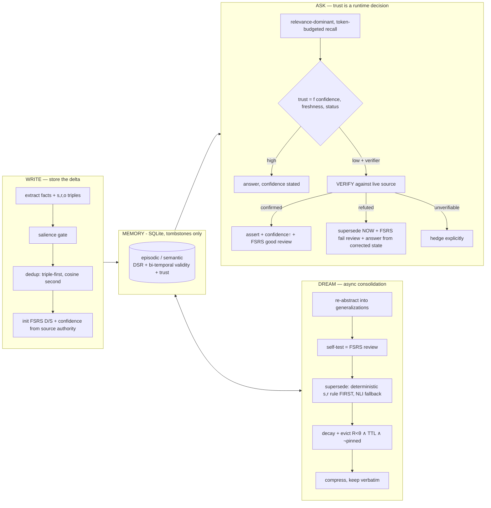
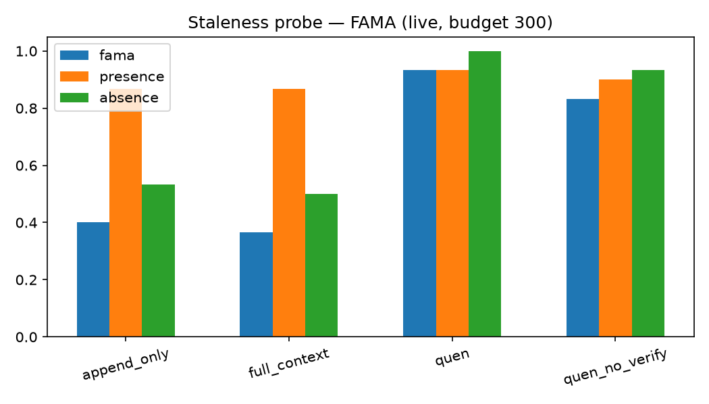
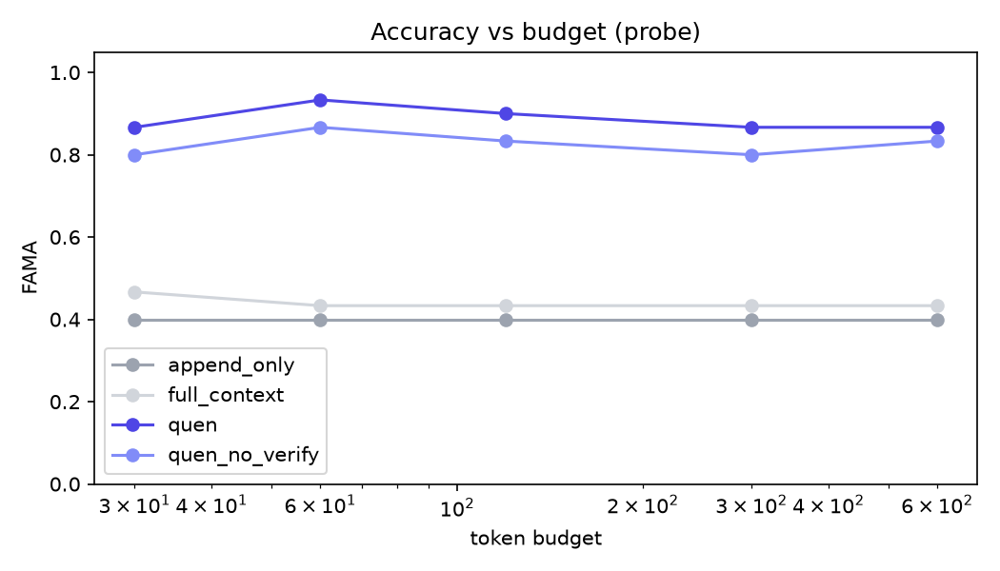
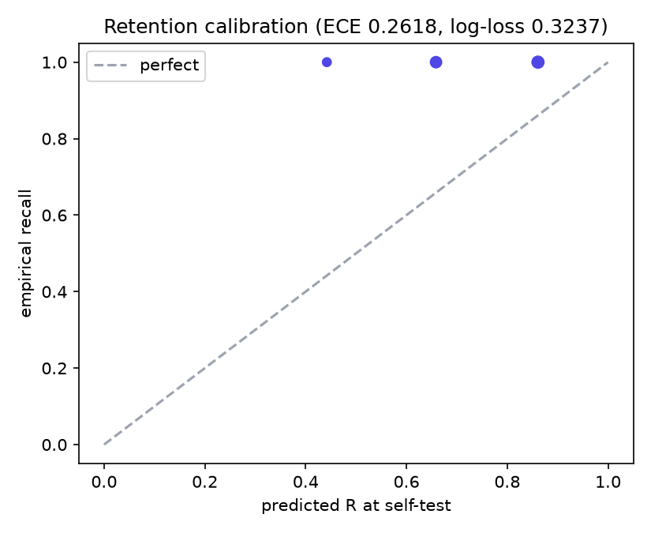
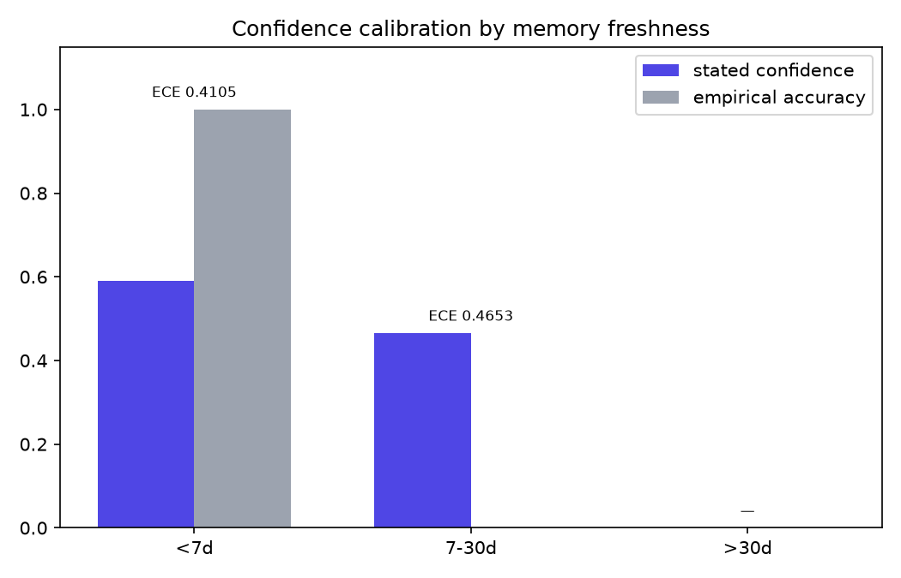
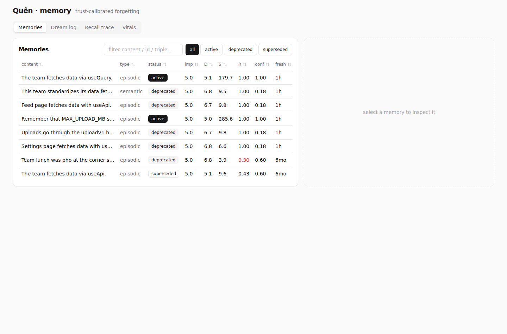
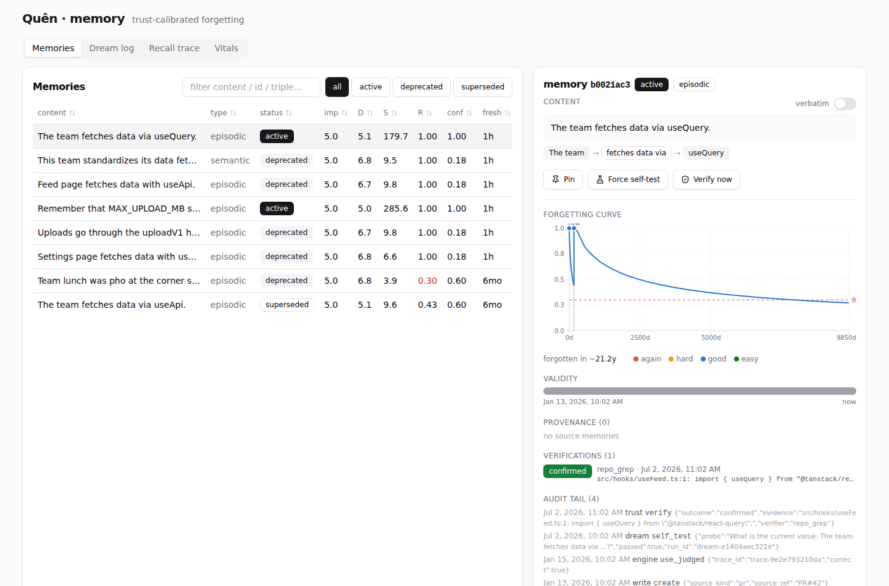
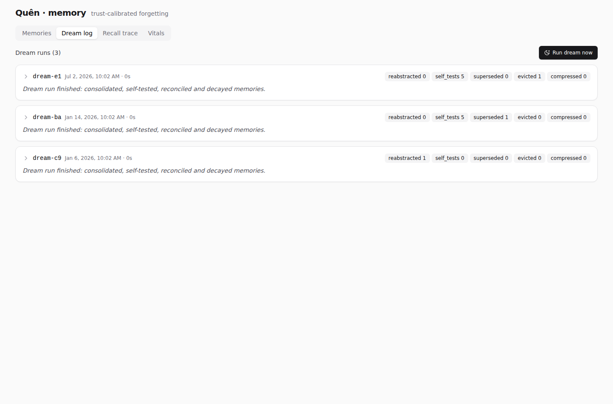
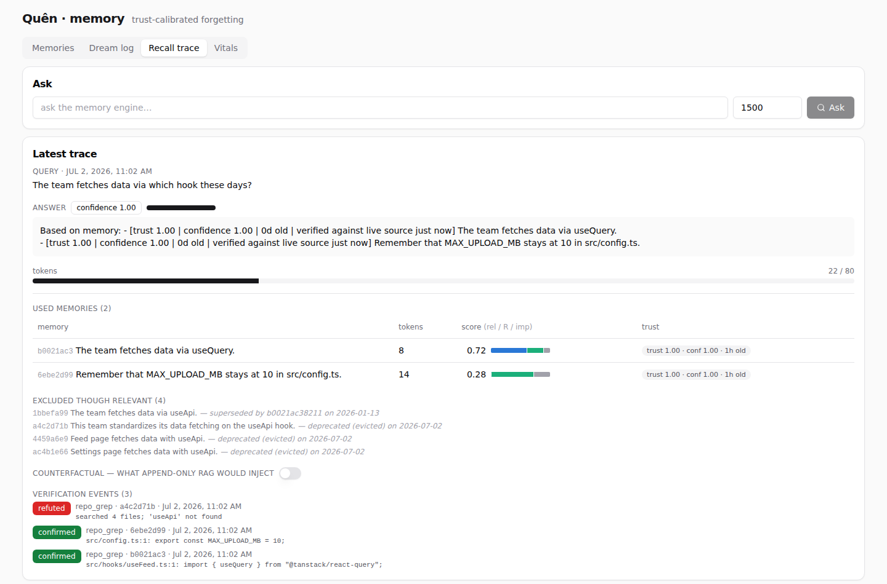
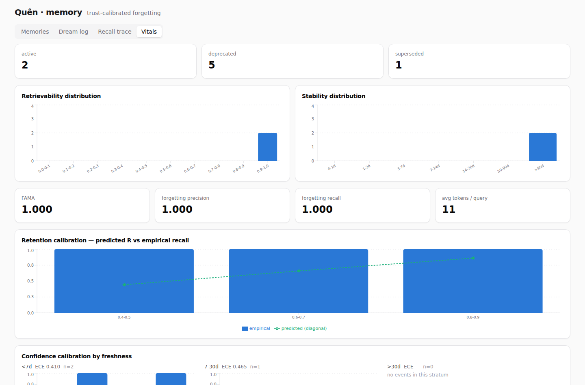

# Quên

> **Quên** *(sounds like **Qwen**; Vietnamese for "to forget")* — a Qwen-powered
> memory that knows what to forget — and how sure to sound.
>
> *Also: Quen is the protective shield sign in The Witcher — it shields your
> agent from stale memory.*

**Trust-calibrated forgetting: an agent memory that knows what to forget, says
how sure it is, and verifies before it asserts.**

Built for the **Qwen Cloud Global AI Hackathon · Track 1: MemoryAgent**.
All LLM and embedding calls run on **Qwen via Alibaba Cloud DashScope**
([`src/quen/alibaba_client.py`](src/quen/alibaba_client.py) is the single
network path — no other provider, ever).

> ⚠️ **Not affiliated.** Quên is a community homage to the Qwen name; it is not
> affiliated with or endorsed by the Qwen / Alibaba Cloud teams.

---

## Why

The sharpest failure mode of agent memory isn't *forgetting too much* — it's
**being confidently wrong from stale memory**. Stale memory rarely fails at
retrieval; it fails by making the agent act confidently on invalidated
assumptions (arXiv 2605.26112). Memora/FAMA (arXiv 2604.20006) measured it:
agents *frequently reuse invalidated memories*.

Quên's answer, in one line:

> **Trust is a runtime decision, not a stored property.** Every answer's stated
> confidence tracks the memory's validity and freshness; low-trust memories
> trigger **verify-before-answer** against the live source; and the
> verification outcome **feeds back into retention as an FSRS review** —
> verification reinforces or invalidates memory. Then we *measure* the
> epistemic honesty: FAMA on a code-staleness probe, plus retention
> calibration and **freshness-stratified confidence calibration**.

To our knowledge no system closes the loop *verification → retention update*,
and none scores hedging against memory freshness. Everything else here —
decay-based forgetting, bi-temporal supersession, confidence-carrying memory —
exists in the literature and is cited below; we claim the closed loop and the
measurement, not the parts.

## How it works



The load-bearing mechanisms:

- **Retention = FSRS-4.5**, equations imported verbatim from
  [open-spaced-repetition](https://github.com/open-spaced-repetition/free-spaced-repetition-scheduler).
  DSR state is an *eviction/ranking prior*, not a scheduler. Reviews come from
  three places: use-in-answer judged good/bad, dream self-tests, and
  **verification outcomes** (the closed loop).
- **Supersession is deterministic first** (MemStrata-style same-(s,r)-new-o
  slot rule, zero LLM calls — embeddings *cannot* detect contradiction,
  AUROC ≈ 0.59), with an LLM-NLI fallback where `augments` **never**
  supersedes (the Buddy/Scout trap). Tombstones only; bi-temporal
  `valid_from/valid_to`; full audit log.
- **Retrieval is relevance-dominant and token-budgeted**: a low-R but highly
  relevant memory surfaces at full strength — decay never suppresses
  relevance. Every recall returns per-memory trust fields, an
  excluded-relevant list ("not used — superseded by X"), and the
  **counterfactual** an append-only RAG would have injected.
- **The trust gate**: `trust = confidence × 2^(−freshness/half-life)` (zero for
  tombstones). Below threshold, with a verifier available (repo-grep for the
  demo), the engine checks the claim against the live source *before*
  answering — and never asserts a stale, unverified memory with full
  assurance. When nothing relevant survives, it **abstains**.

## Results (live — Qwen via Alibaba Cloud DashScope, canonical run 2026-07-03)

Models: `text-embedding-v4` + `qwen-flash` (extraction/salience/judging) +
`qwen3.5-plus` (reader/NLI/reflection). Token budget 300, identical reader
prompt across configs. Every number is produced by the committed scripts and
lives in [`eval/out/`](eval/out); n is small, so 95% Wilson CIs and paired
exact McNemar tests are reported instead of bare points.

### Code-staleness probe — the workload Quên is built for (n=30)

Facts get invalidated mid-history (refactor PRs, implicit reversals),
same-subject augmentations must *survive*, abstention cases must be declined,
and `live_files` cases exercise verify-before-answer. Headline metric:
**FAMA** = presence-of-valid ∧ absence-of-invalidated (Memora, 2604.20006):

| config | FAMA | 95% CI | presence | absence | tokens/query¹ |
|---|---|---|---|---|---|
| append-only RAG | 0.400 | [0.25, 0.58] | 0.933 | 0.467 | 16.8 |
| full-context (truncate oldest) | 0.433 | [0.27, 0.61] | 0.967 | 0.467 | 16.8 |
| **Quên (ours)** | **0.933** | [0.79, 0.98] | 0.967 | 0.967 | 27.9 |
| ours − verify (ablation) | 0.800 | [0.63, 0.91] | 0.900 | 0.867 | 30.3 |

- Paired McNemar, Quên vs append-only: 16–0 discordant pairs, **p = 3×10⁻⁵**;
  vs full-context 16–1, p = 2.7×10⁻⁴.
- **Forgetting precision/recall 0.842 / 0.938** (negation-aware;
  over-forgetting counts against us).
- The verify ablation (+0.13 FAMA) is dominated by the cases where *no
  ingested event ever contradicted* the stale fact — only the live repo
  could. That is the verify-before-answer beat closing the loop.
- Abstention accuracy 1.0 in every config, judged from delivered text only.
- **Paraphrase robustness** (anti-overfit control): the probe histories
  re-phrased once by Qwen and frozen before scoring
  (`eval/data/probe_paraphrased.json`): Quên 0.933 — **no drop** — ablation
  0.867, baselines 0.433. The mechanism, not our phrasing, carries the result.

¹ What the reader actually saw, trust tags and hedges included — the trust
channel is not free and we count it. Quên's *content* tokens are lower than
the baselines' (forgetting works); the fixed per-memory tag overhead
amortizes at realistic memory sizes.

### LongMemEval — external anchor with **no staleness** (n=229: KU 72, TR 127, abstention 30)

[LongMemEval](https://arxiv.org/abs/2410.10813) oracle sessions are
evidence-only: nothing is ever invalidated, so this measures raw QA recall —
the workload where forgetting can only cost. We report it because a memory
system you can trust must show where it loses:

| config | knowledge-update | temporal-reasoning | abstention | tokens/query |
|---|---|---|---|---|
| append-only RAG (turn-level) | **0.542** [0.43, 0.65] | 0.205 [0.14, 0.28] | 0.867 | 293 |
| full-context (truncate oldest) | 0.028 [0.01, 0.10] | 0.118 [0.07, 0.19] | 1.000² | 245 |
| Quên | 0.306 [0.21, 0.42] | 0.197 [0.14, 0.27] | 0.867 | 325 |

Quên **loses knowledge-update to append-only** (McNemar 5–22, p = 0.0015):
LLM fact extraction drops details that verbatim turn storage keeps, and with
zero staleness in the data there is nothing for supersession or decay to earn
back. Temporal reasoning and abstention are exact statistical ties (7–8 and
4–4 discordant, p = 1.0). Quên beats full-context overall (32–6,
p = 2.4×10⁻⁵). Read together with the probe: **forgetting is a measurable
tax on staleness-free recall and a large win the moment the world changes.**
Scoring is exact word-boundary match — conservative for every config.

² Perfect abstention by collapse: at this budget full-context rarely sees
the evidence for *any* question, so it declines everything — including the
30 questions it should decline.

### Calibration (small n — direction, not proof)

- **Retention**: predicted FSRS R vs use-judged recall on the live demo
  narrative: ECE 0.111, log-loss 0.626 (n=7 events).
- **Answer confidence by freshness** (probe): overall ECE 0.227 (n=30) —
  the stated confidence is a trust-weighted heuristic and is reported as
  such, not sold as calibrated probability.

### Accuracy-vs-budget curve (live)

FAMA on the probe at five token budgets (chart: `eval/out/budget_curve.png`):

| budget | append-only | full-context | **Quên** | Quên − verify |
|---|---|---|---|---|
| 30 | 0.40 | 0.47 | **0.87** | 0.80 |
| 60 | 0.40 | 0.43 | **0.93** | 0.87 |
| 120 | 0.40 | 0.43 | **0.90** | 0.83 |
| 300 | 0.40 | 0.43 | **0.87** | 0.80 |
| 600 | 0.40 | 0.43 | **0.87** | 0.83 |

The baselines are *flat*: probe memories are small enough that everything
they retrieve already fits at budget 30, so their failures are trust
failures (echoing invalidated facts), not budget starvation — no amount of
context fixes that. Quên holds its margin at every budget and needs only
~27 delivered tokens/query to do it.

### What the canonical run cost (from `usage_summary()` counters × DashScope intl pricing)

| stage | qwen-flash in/out | qwen3.5-plus in/out | embed-v4 in | USD |
|---|---|---|---|---|
| probe (30 cases × 4 configs) | 69k / 14k | 30k / 5k | 3k | 0.03 |
| paraphrase probe | 70k / 15k | 30k / 5k | 3k | 0.03 |
| LongMemEval baselines (229 × 2) | — | 185k / 30k | 1.57M | 0.26 |
| LongMemEval Quên (229, full engine) | 6.26M / 1.18M | 293k / 61k | 227k | 1.07 |
| live demo seed (80-day narrative) | 14k / 2k | 2k / 0.3k | 0.3k | 0.003 |
| budget curve (30 × 4 × 5 budgets) | 346k / 72k | 150k / 26k | 16k | 0.17 |
| **total (canonical pass)** | | | | **≈ $1.6** |

A full from-scratch reproduction of every live number in this README lands
well under $5.

### Offline dry-run (no API key — deterministic pipeline validation)

The whole eval also runs **without any key** (hashing embedder + scripted
extractive reader; `pytest` runs this way too). These numbers validate the
*memory mechanics* under an identical reader/budget, not LLM quality:
append-only 0.37 · full-context 0.37 · **Quên 0.90** · no-verify 0.83
(same 30 cases). The live run above is the canonical result.

| | |
|---|---|
|  |  |
|  |  |

More charts in [`eval/out/`](eval/out), including the 52-week long-horizon
simulation (`long_horizon.png`).

```bash
.venv/bin/python eval/run_probe.py            # probe, offline (default)
.venv/bin/python eval/run_probe.py --live     # probe on Qwen via DashScope
.venv/bin/python eval/run_longmemeval.py      # LongMemEval KU/Temporal/Abstention
.venv/bin/python eval/budget_curve.py
.venv/bin/python eval/calibration.py --db data/demo.db
.venv/bin/python eval/charts.py
```

## Status & test results (2026-07-03)

- `pytest`: **156 passed** — fully offline and deterministic (hashing
  embedder + scripted LLM; the suite never touches the network).
- `cd dashboard && npm run build`: ✓ (Vite production build).
- Canonical live eval on DashScope completed end-to-end: probe (30×4),
  paraphrase probe (30×4), LongMemEval (687/687 rows), budget curve,
  live 80-day demo seed (3 supersessions — 1 deterministic, 2 NLI — one
  eviction, one live refutation, three live confirmations), calibration.
  Raw rows and summaries are committed under [`eval/out/`](eval/out).

## Quickstart

```bash
uv venv .venv && uv pip install -e ".[dev]"
.venv/bin/pytest                    # 156 offline, deterministic tests

# seed the full demo narrative (no API key needed) and serve it
.venv/bin/python scripts/seed_demo.py
QUEN_OFFLINE=1 QUEN_DB_PATH=data/demo.db \
  QUEN_VERIFY_REPO=scripts/demo_repo .venv/bin/quen-api    # :8000

cd dashboard && npm install && npm run dev                  # :5173
```

**Deploy (Alibaba Cloud ECS, one command):** see
[`deploy/README.md`](deploy/README.md) — `quen-api` serves the built
dashboard from the same origin (`QUEN_DASHBOARD_DIST`), so one small
instance runs everything; `deploy/setup.sh` is the whole server setup.

Live mode: copy `.env.example` → `.env`, set `DASHSCOPE_API_KEY`
(international endpoint: `dashscope-intl.aliyuncs.com`), unset `QUEN_OFFLINE`.
Smoke test the wiring: `.venv/bin/python -m quen.alibaba_client` → `quen-ok`.
Models: `qwen3.5-plus` (reader/NLI/reflection), `qwen-flash`
(extraction/judging), `text-embedding-v4`.

### The demo narrative (what the seeder builds)

180 days of team memory: `useApi` is learned, generalized in a dream pass,
then a migration PR lands → the **deterministic slot rule** supersedes it with
`useQuery` (no LLM call, inspectable in the Dream log). Trivia decays and is
**evicted** (R < θ, past TTL, not pinned). At day 180 the trust gate fires on
three aged memories: `uploadV1` is **refuted** against the live repo
(tombstoned on the spot + FSRS fail review), `MAX_UPLOAD_MB` and `useQuery`
are **confirmed** (confidence ↑, `last_verified_at`, FSRS good review). The
final recall trace shows the used memories with score breakdowns and trust
chips, the excluded `useApi` ("superseded by … on …"), and the counterfactual
toggle — what a plain RAG would have wrongly injected.

## MCP server — drop-in for any harness

A thin FastMCP wrapper (server name `quen`) over the same engine — mount it
from Claude Code, Cursor, OpenAI Agents SDK, LangGraph, or any MCP client:

```bash
.venv/bin/quen-mcp    # stdio transport
```

Tools: `remember(observation)` · `recall(query, token_budget)` (memories
**with trust fields** + `needs_verification` flags) · `dream()` ·
`verify_hint(memory_id, result, evidence)` (the harness verifies with *its*
live tools — grep, file read, URL fetch — and reports back; the engine applies
the confidence update + FSRS review) · `pin(memory_id)` · `inspect(filter)`.

Memory-as-MCP exists (MemMachine, Mem0, FSRS-memory servers) — the packaging
is adoption, not novelty. The wrapper stays thin; the eval never uses it.

## Dashboard

Vite + React 18 + TS + Tailwind + shadcn-style components + recharts, SWR
polling. Five panels: **Memories table** (live R computed client-side from
FSRS constants served by `/config`, decaying before your eyes), **Memory
detail** (forgetting curve with review markers and the eviction threshold θ,
validity timeline, verbatim toggle, Pin / Force self-test / Verify now),
**Dream log** (per-run consolidations, self-tests with ΔS, supersessions
badged `deterministic|NLI`, evictions, journal), **Recall trace** (token
meter, score breakdown, trust chips, excluded-relevant, counterfactual
toggle, verification events), **Vitals** (status counts, R/S histograms, KPI
tiles fed by real eval runs only — never fabricated, and the two calibration
charts).

| Memories — live FSRS decay | Memory detail — forgetting curve & validity |
|---|---|
|  |  |

| Dream log | Recall trace | Vitals |
|---|---|---|
|  |  |  |

## Algorithmic biases — found & fixed

We ran an adversarial audit of our own algorithms (two independent
bias-hunting passes + literature grounding + empirical repros on the real
stack). Everything below is reproduced in `tests/test_bias_audit.py` and
`tests/test_review_fixes.py`; the un-fixable ones are disclosed instead.

| Bias / defect | Evidence | Fix |
|---|---|---|
| **The store couldn't forget.** Self-test probes were built *from* the memory and answered *with* the memory in the pool → passes were near-certain and independent of R, and each GOOD review at low R multiplied stability up to ×27.8 (FSRS spacing term) — immortalizing exactly the memories closest to eviction | analytical repro on FSRS-4.5 defaults; 52-week sim: **0 evictions in a year** | self-test passes grade HARD with a ×2 growth cap and log as `retrieval_health`, never retention evidence; retention calibration re-sourced from use-judged outcomes (which *can* fail with time) |
| **Eviction starvation.** Greedy budget-fill included barely-relevant memories, whose `last_accessed_at` touch reset the eviction TTL on every ask | same sim | inclusion relevance floor (irrelevant memories never enter the context); θ rescaled to the FSRS-4.5 curve (R<0.3 needs 43·S days — unreachable; 0.5 ≈ 12.8·S). Sim now evicts (0 → 83) and cuts tokens/query below append-only |
| **Over-forgetting multi-valued facts.** The deterministic same-(s,r)-new-o rule treated *every* slot as single-valued: `(team, uses, Postgres)` + `(team, uses, Redis)` superseded Postgres — augmentation destroyed as contradiction. Our own probe hid this (its augmentation cases all used different subjects) | new same-subject augmentation probe cases | functional-relation gate (KB-style): only single-current-value relations take the deterministic path; ambiguous relations ("uses", "prefers") route to NLI, where `augments` protects both |
| **Recency bias in trust.** `trust = conf × 2^(−age/30d)` hedged a twice-confirmed two-year-old fact like day-old gossip | construction | freshness half-life stretches with *earned* FSRS stability (each successful review is durability evidence). Caveat disclosed: S measures rehearsal, not world drift |
| **Recency-only arbitration.** A casual chat mention could silently retire a merged-PR fact (spec says recency+authority) | construction | authority guard: a supersession whose source authority trails by ≥0.25 is blocked and audited; a ≥0.9-confidence NLI contradiction overrides. Conflicts resolve later via verify-before-answer |
| **Thrown-away corroboration.** Re-observing a fact reinforced FSRS but never refreshed freshness/confidence — a fact re-stated daily still decayed to maximal hedging | construction | dedup-reinforce refreshes `last_verified_at` (the world just re-asserted it) and accumulates confidence (capped 0.9) |
| **Unrecoverable write gate + rater bias.** The live salience rater scored "team fetches data via useQuery" below the gate *because useQuery is famous* — silently dropping an update | caught in live runs | prompt fixed (rate the *binding*, not the fame) and the gate softened: low-salience facts store weak (lapse-level stability) and decay, instead of being skipped forever |
| **Zombie self-tests.** A persistently failing memory got +1 importance and a TTL-refreshing touch per failure, and monopolized the sample slots forever | construction | one-time nudge, no access touch (introspection ≠ usage), 7-day failure backoff |
| **Laundered provenance.** Refuting/superseding a memory left generalizations built on it fully trusted | construction | provenance penalty: derived memories lose 50% confidence, audited |
| **Self-serving scoring.** FAMA credited our internal `abstained` flag (baselines can't emit one); past-tense words excused stale reliance; token accounting hid our trust-tag overhead; `min`-freshness binning hid stale reliance in the calibration | audit of our own eval | abstention judged from delivered text for all configs; before/after cue windows narrowed; budgets count delivered tokens incl. tag overhead; strata keyed by the *stalest* memory relied upon; Wilson CIs + paired McNemar; the paraphrased probe variant is frozen in `eval/data/probe_paraphrased.json` |
| **Strawman baselines.** The LongMemEval baselines stored whole 2–5k-token sessions as single units against a 300-token answer budget — the greedy fill fit *nothing* and both baselines answered every question from an empty context (`tokens_used=0` on all 458 rows, knowledge-update 0.0) while we looked great | caught in the first canonical v4 run | baselines rebuilt at turn-level granularity (the round-level unit the LongMemEval paper recommends), long turns sentence-windowed; re-run — append-only now *beats* us on staleness-free knowledge-update, and we report that above |
| **Memory poisoning surface** ([2606.04329](https://arxiv.org/pdf/2606.04329), [survey](https://arxiv.org/html/2604.16548v1), [MemAudit](https://arxiv.org/pdf/2605.23723)) | literature; ~84% attack success rates reported on agent memory generally | memories are data-fenced in the answer prompt with delimiter neutralization + a no-instructions rule. *Mitigation, not a fix* — in-context defenses are bypassable; the audit log + provenance exist for post-hoc forensics (MemAudit-style). `verify_hint`/`source_kind` are trusted-harness surfaces by design |

Still open, disclosed: FSRS weights are human-flashcard priors (retention
calibration now measures them against use-judged outcomes); `len/4` token
estimation under-counts non-Latin scripts; retrieval weights are untuned;
answer-confidence is a heuristic (measured by ECE, small n); relation
functionality is a fixed list, not learned.

## Honesty & limitations

- **The probe is small (n=30) and ours.** We mitigate with Wilson CIs,
  paired McNemar, a frozen Qwen-paraphrased variant, and LongMemEval as the
  external anchor — including the subset where we *lose* (knowledge-update
  vs turn-level append-only RAG, p = 0.0015). Dry-run numbers measure
  mechanics, not models; the live tables are the canonical ones.
- **Exact-match scoring under-reports paraphrases** for every config alike;
  all numbers are comparative-within-eval, not absolute.
- **RepoGrepVerifier checks identifier presence, not claim truth**: a renamed
  identifier refutes; a changed *value* behind the same identifier confirms.
  Comment-only hits count as confirmed. It is the demo verifier; the MCP
  `verify_hint` path lets a real harness bring real verification.
- **The salience gate and NLI fallback inherit LLM judgment** — that's why
  supersession is deterministic-first and confidence-gated, contradictions
  never hard-delete, and every mutation is audited.
- FSRS default weights are used as published, not re-fit to agent-memory data.

## Research it stands on (cite generously, claim narrowly)

Retrieval scoring: Generative Agents (2304.03442). Retention: FSRS/DSR
(open-spaced-repetition). Consolidation: Letta sleep-time compute; A-MEM
(2502.12110). Supersession: MemStrata (2606.26511, deterministic (s,r,o) rule
+ the AUROC-0.59 finding); TOKI (2606.06240, bitemporal operators);
Knowledge-Conflicts survey (2403.08319); Memory-R1 (2508.19828, augmentation ≠
contradiction). Trust at answer time: Scaling-the-Harness (2605.26112); UAM
(2601.15703); Hindsight/CARA (2512.12818); abstention-aware retrieval for
coding agents (2604.27283). Measurement: Memora + FAMA (2604.20006);
LongMemEval (2410.10813). Efficiency: Mem0 (2504.19413). Anti-pattern:
MemPalace critique (2604.21284, why `content_verbatim` never dies).

## Repo map

```
src/quen/          engine: models · fsrs · store · llm · embeddings ·
                   write_pipeline · retrieval · supersession · dream ·
                   trust · verifiers · engine · api · mcp_server ·
                   alibaba_client (THE proof artifact)
tests/             143 offline deterministic tests (TDD list from the spec)
eval/              FAMA probe · LongMemEval · calibrations · budget curve
dashboard/         the glass box
scripts/           seed_demo.py + demo_repo fixture
docs/SPEC.md       master spec v3
```

## License

MIT.

---

*The line we defend: **memory that knows what to forget — and how sure to
sound — because it checks.***
