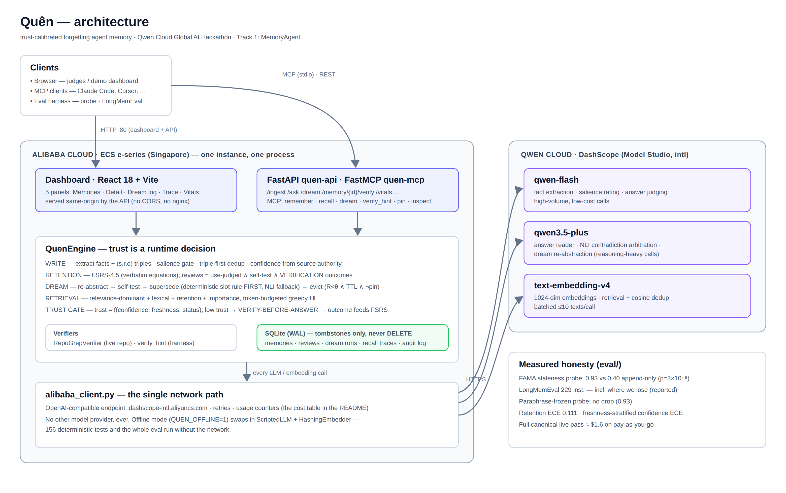
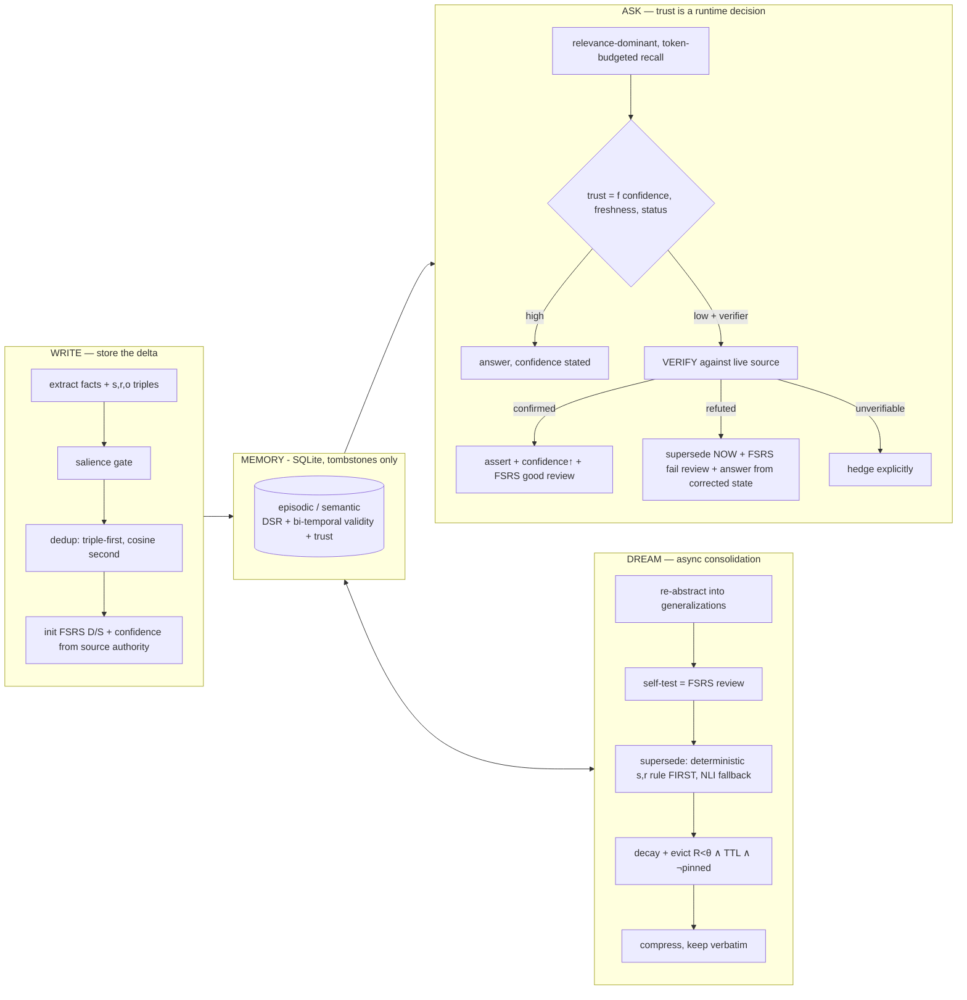

# Quên

> **Quên** *(sounds like **Qwen**; Vietnamese for "to forget")* — a Qwen-powered
> memory that knows what to forget — and how sure to sound.
>
> *Also: Quen is the protective shield sign in The Witcher — it shields your
> agent from stale memory.*

**Trust-calibrated forgetting: an agent memory that knows what to forget, says
how sure it is, and verifies before it asserts.**

Built for the **Qwen Cloud Global AI Hackathon · Track 1: MemoryAgent**.
All LLM and embedding calls run on **Qwen via Alibaba Cloud DashScope**
([`src/quen/alibaba_client.py`](src/quen/alibaba_client.py) is the single
network path — no other provider, ever).

> ⚠️ **Not affiliated.** Quên is a community homage to the Qwen name; it is not
> affiliated with or endorsed by the Qwen / Alibaba Cloud teams.

---

## Why

The sharpest failure mode of agent memory isn't *forgetting too much* — it's
**being confidently wrong from stale memory**. Stale memory rarely fails at
retrieval; it fails by making the agent act confidently on invalidated
assumptions ([arXiv 2605.26112](https://arxiv.org/abs/2605.26112)).
Memora/FAMA ([arXiv 2604.20006](https://arxiv.org/abs/2604.20006)) measured
it: agents *frequently reuse invalidated memories*.

Quên's answer, in one line:

> **Trust is a runtime decision, not a stored property — hedge by freshness,
> verify before asserting, and feed the verdict back into retention.**

In full: every answer's stated confidence tracks the memory's validity and
freshness; low-trust memories trigger **verify-before-answer** against the
live source; and the verification outcome lands back in retention **as an
FSRS review** — reinforcing or invalidating the memory. Then we *measure*
the epistemic honesty: FAMA on a code-staleness probe, plus retention
calibration and **freshness-stratified confidence calibration**.

To our knowledge no system closes the loop *verification → retention update*,
and none scores hedging against memory freshness. Everything else here —
decay-based forgetting, bi-temporal supersession, confidence-carrying memory —
exists in the literature and is cited below; we claim the closed loop and the
measurement, not the parts.

## How it works





The load-bearing mechanisms:

- **Retention = FSRS-4.5**, equations imported verbatim from
  [open-spaced-repetition](https://github.com/open-spaced-repetition/free-spaced-repetition-scheduler).
  DSR state is an *eviction/ranking prior*, not a scheduler. Reviews come from
  three places: use-in-answer judged good/bad, dream self-tests, and
  **verification outcomes** (the closed loop).
- **Supersession is deterministic first**
  ([MemStrata](https://arxiv.org/abs/2606.26511)-style same-(s,r)-new-o
  slot rule, zero LLM calls — embeddings *cannot* detect contradiction,
  AUROC ≈ 0.59), with an LLM-NLI fallback where `augments` **never**
  supersedes (the Buddy/Scout trap,
  [Memory-R1](https://arxiv.org/abs/2508.19828)). Tombstones only;
  bi-temporal `valid_from/valid_to`; full audit log.
- **Retrieval is relevance-dominant and token-budgeted**: a low-R but highly
  relevant memory surfaces at full strength — decay never suppresses
  relevance. Every recall returns per-memory trust fields, an
  excluded-relevant list ("not used — superseded by X"), and the
  **counterfactual** an append-only RAG would have injected.
- **The trust gate**: `trust = confidence × 2^(−freshness/half-life)` (zero for
  tombstones). Below threshold, with a verifier available (repo-grep for the
  demo), the engine checks the claim against the live source *before*
  answering — and never asserts a stale, unverified memory with full
  assurance. When nothing relevant survives, it **abstains**.

## Results (live — Qwen via Alibaba Cloud DashScope, canonical run v5, 2026-07-06)

Models: `text-embedding-v4` + `qwen3.6-flash` (extraction/salience/judging)
+ `qwen3.7-plus` (reader/NLI/reflection/benchmark judge). Token budget 300,
identical reader prompt across configs. Every number is produced by the
committed scripts and lives in [`eval/out/`](eval/out); n is small, so 95%
Wilson CIs and paired exact McNemar tests are reported instead of bare
points. The previous canonical run (v4, 2026-07-03, qwen3.5 generation) is
preserved in git history for comparison; the probe scored identically
across model generations.

### Code-staleness probe — the workload Quên is built for (n=30)

Facts get invalidated mid-history (refactor PRs, implicit reversals),
same-subject augmentations must *survive*, abstention cases must be declined,
and `live_files` cases exercise verify-before-answer. Headline metric:
**FAMA** = presence-of-valid ∧ absence-of-invalidated (Memora, 2604.20006):

| config | FAMA | 95% CI | presence | absence | tokens/query¹ |
|---|---|---|---|---|---|
| append-only RAG | 0.400 | [0.25, 0.58] | 0.867 | 0.533 | 16.8 |
| full-context (truncate oldest) | 0.367 | [0.22, 0.54] | 0.867 | 0.500 | 16.8 |
| **Quên (ours)** | **0.933** | [0.79, 0.98] | 0.933 | **1.000** | 18.6 |
| ours − verify (ablation) | 0.833 | [0.66, 0.93] | 0.900 | 0.933 | 20.3 |

- Paired McNemar, Quên vs append-only: 16–0 discordant pairs, **p = 3×10⁻⁵**;
  vs full-context 17–0, p = 2×10⁻⁵.
- **Forgetting precision/recall 0.941 / 1.00** (negation-aware;
  over-forgetting counts against us — the augmentation-vs-update fix removed
  the wrongful tombstones that held v4 at 0.842).
- Absence 1.000: Quên relied on an invalidated fact **zero** times in 30
  cases.
- The verify ablation (+0.10 FAMA) is dominated by the cases where *no
  ingested event ever contradicted* the stale fact — only the live repo
  could. That is the verify-before-answer beat closing the loop.
- **Paraphrase robustness** (untouched holdout): the probe histories
  re-phrased once by Qwen and frozen before any tuning
  (`eval/data/probe_paraphrased.json`): Quên 0.900, ablation 0.900,
  baselines 0.433/0.400. The mechanism, not our phrasing, carries the
  result.
- **Model-generation stability**: the v4 canonical run (qwen3.5 generation)
  scored the same probe FAMA 0.933 — two model generations, same result.
  Models are two env vars (`QUEN_FAST_MODEL`/`QUEN_CHAT_MODEL`).

¹ What the reader actually saw, trust tags and hedges included — the trust
channel is not free and we count it. Quên's *content* tokens are lower than
the baselines' (forgetting works); the compact tag grammar keeps the trust
channel at ~2 tokens/memory.

### LongMemEval — external anchor with **no staleness** (n=229: KU 72, TR 127, abstention 30)

[LongMemEval](https://arxiv.org/abs/2410.10813) oracle sessions are
evidence-only: nothing is ever invalidated, so this measures raw QA recall —
historically the workload where forgetting could only cost. Primary metric
= LLM judge (the benchmark's own protocol; accepts paraphrase and
number-form variants, requires a clean decline on abstention items),
applied to every config symmetrically; the conservative exact word-boundary
match is reported alongside:

| config | knowledge-update (judge / exact) | temporal-reasoning (judge / exact) | abstention | tokens/query |
|---|---|---|---|---|
| **Quên** | **0.653** [0.54, 0.75] / 0.542 | **0.409** [0.33, 0.50] / 0.291 | 0.733 | **209** |
| append-only RAG (turn-level) | 0.569 [0.45, 0.68] / 0.556 | 0.189 [0.13, 0.27] / 0.189 | 0.800 | 293 |
| full-context (truncate oldest) | 0.028 / 0.028 | 0.016 / 0.102 | 0.967² | 245 |

**Quên now beats append-only overall: McNemar 49–17, p = 1×10⁻⁴** (the v4
run was the reverse direction — the failure-mode fixes below flipped it).
Temporal reasoning is the decisive subset (31–3, p = 1×10⁻⁶) and it was an
untouched holdout — none of the fixes targeted TR, yet keeping in-passing
dates verbatim and preferring newer memories on conflict more than doubled
it. Knowledge-update leads but is not individually significant (17–11,
p = 0.34). Abstention trailed append-only in this run (0.733 vs 0.800):
the reader hedged-then-guessed where a clean decline was wanted; a
subsequent one-sentence reader rule ("with no record of the thing asked,
say so and stop") lifted the same subset to **0.833**
(`eval/out/abstention_recheck.json`, 2026-07-10). Quên does all this from
**209 tokens/query vs 293** for append-only.

² Near-perfect abstention by collapse: at this budget full-context rarely
sees the evidence for *any* question, so it declines almost everything —
including the 30 questions it should decline.

### LongMemEval-S — the full haystack (~122k-token histories, 40× the noise)

The oracle setting above hands every system evidence-only sessions. The
**S** variant is the real needle-in-a-haystack: the same 229 questions
buried in ~47 sessions (~122k tokens) of mostly-irrelevant chat, ingested
with a write-count dream cadence (consolidate every 16 sessions). This run
is **partial — stopped at our cost cap** (Quên 141/229 instances,
baselines 186/229; real next-gen model prices came in ~4× our estimate and
we stopped rather than overspend; every completed row is reported):

| config | accuracy (judge) | 95% CI | exact | abstention | tokens/query |
|---|---|---|---|---|---|
| **Quên** | **0.423** | [0.34, 0.51] | 0.398 | 14/18 | **270** |
| append-only RAG (turn-level) | 0.253 | [0.19, 0.33] | 0.247 | 20/24 | 302 |
| full-context (truncate oldest) | 0.000 | — | 0.043 | 24/24³ | 250 |

Paired McNemar on the 102 questions both systems completed: **Quên 16–5,
p = 0.027**. Everyone falls in the haystack — but selective memory falls
least: Quên distills 122k tokens into salient facts, so its 300-token
budget carries signal where append-only's carries noise. **The more noise,
the more forgetting is worth** — the mirror image of the oracle table,
where verbatim storage had the advantage. One haystack session tripped
DashScope's content filter and was skipped (recorded per row).

³ Declining everything again — in the haystack even harder, since the
needle almost never surfaces in its 300-token window.

### Calibration (small n — direction, not proof)

- **Retention**: predicted FSRS R vs use-judged recall on the live demo
  narrative: ECE 0.111, log-loss 0.626 (n=7 events).
- **Answer confidence by freshness** (probe): overall **ECE 0.116** (n=30)
  — down from 0.227 in v4 after recalibrating the stated number against
  measured accuracy (raw trust was systematically under-confident); hedging
  language stays tied to raw trust.
- **Calibration does not transfer across noise regimes** — an honest
  finding from the haystack run: the same stated confidences that are
  well-calibrated on oracle/probe workloads run *over*-confident on
  LongMemEval-S (accuracy ~0.33–0.47 in the 0.5–0.75 band; fit-set ECE 0.21
  raw). A single monotone map cannot serve both regimes, so we keep the
  oracle-fit map and disclose this; retrieval-quality-aware calibration is
  on the roadmap.

### Accuracy-vs-budget curve (live)

FAMA on the probe at five token budgets (chart: `eval/out/budget_curve.png`):

| budget | append-only | **Quên** |
|---|---|---|
| 30 | 0.40 | **0.83** |
| 60 | 0.37 | **0.90** |
| 120 | 0.37 | **0.90** |
| 300 | 0.33 | **0.97** |
| 600 | 0.37 | **0.93** |

The baselines are *flat*: probe memories are small enough that everything
they retrieve already fits at budget 30, so their failures are trust
failures (echoing invalidated facts), not budget starvation — no amount of
context fixes that. Quên holds its margin at every budget and needs only
~19 delivered tokens/query to do it (full 4-config grid in
`eval/out/budget_curve.json`).

### What the canonical run cost (from `usage_summary()` counters × DashScope intl pricing)

Prices: qwen3.6-flash $0.19/$1.13, qwen3.7-plus $0.32/$1.28 (first tier),
text-embedding-v4 ~$0.07 per 1M tokens (intl endpoint). An earlier revision
of this table used previous-generation prices (~4× lower) — corrected here,
and the lesson (verify the price card before launching a big run) is now
part of our own bias table.

| stage | qwen3.6-flash in/out | qwen3.7-plus in/out | embed-v4 in | USD |
|---|---|---|---|---|
| LongMemEval-oracle baselines (229 × 2) | — | 244k / 22k | 1.11M | 0.19 |
| LongMemEval-oracle Quên (229 incl. KU dev round) | 9.12M / 0.91M | 533k / 76k | 965k | 3.10 |
| probe + paraphrase (2 × 30 × 4) | ~140k / 30k | ~60k / 10k | ~7k | ~0.09 |
| budget curve (30 × 4 × 5 budgets) | ~420k / 90k | ~150k / 26k | ~16k | ~0.26 |
| live demo seed (80-day narrative) | ~15k / 2k | ~3k / 0.3k | ~0.3k | ~0.01 |
| **canonical v5 pass (oracle)** | | | | **≈ $3.7** |
| LongMemEval-S haystack, partial (62–81%, ~28M-token histories × 3 configs) | | | | ≈ $27 (billing-actual) |

The haystack is where the money goes: every config must READ ~122k tokens
per question, so ingestion dominates and forgetting pays for itself at
answer time, not ingest time. `usage_summary()` also reports
`cached_tokens`: DashScope's [implicit context
cache](https://www.alibabacloud.com/help/en/model-studio/context-cache)
bills repeated prompt prefixes (min 1024 cacheable tokens) at a fraction of
the fresh-input rate, so production workloads with stable instruction
prefixes pay less than this table's naive rates.

### Offline dry-run (no API key — deterministic pipeline validation)

The whole eval also runs **without any key** (hashing embedder + scripted
extractive reader; `pytest` runs this way too). These numbers validate the
*memory mechanics* under an identical reader/budget, not LLM quality:
append-only 0.37 · full-context 0.37 · **Quên 0.90** · no-verify 0.83
(same 30 cases). The live run above is the canonical result. With the
compact trust-tag grammar (default since) the same offline probe delivers
**18.9 tokens/query instead of 29.1 (−35%) at identical FAMA** — the trust
channel got cheaper, not weaker.

| | |
|---|---|
|  |  |
|  |  |

More charts in [`eval/out/`](eval/out), including the 52-week long-horizon
simulation (`long_horizon.png`): at week 52 Quên answers from **221
tokens/query vs 427 for append-only**, out of an active store 6× smaller
(950 vs 5,757 tokens; 203 evictions over the year; stale-free answer rate
holds 1.0 while append-only collapses to 0.5; mean FAMA 0.90 vs 0.27).

```bash
.venv/bin/python eval/run_probe.py            # probe, offline (default)
.venv/bin/python eval/run_probe.py --live     # probe on Qwen via DashScope
.venv/bin/python eval/run_longmemeval.py      # LongMemEval KU/Temporal/Abstention
.venv/bin/python eval/budget_curve.py
.venv/bin/python eval/calibration.py --db data/demo.db
.venv/bin/python eval/charts.py
```

## Status & test results (2026-07-10)

- `pytest`: **189 passed** — fully offline and deterministic (hashing
  embedder + scripted LLM; the suite never touches the network).
- `cd dashboard && npm run build`: ✓ (Vite production build).
- Canonical live eval on DashScope completed end-to-end: probe (30×4),
  paraphrase probe (30×4), LongMemEval (687/687 rows), budget curve,
  live 80-day demo seed (3 supersessions — 1 deterministic, 2 NLI — one
  eviction, one live refutation, three live confirmations), calibration.
  Raw rows and summaries are committed under [`eval/out/`](eval/out).

## Quickstart

```bash
uv venv .venv && uv pip install -e ".[dev]"
.venv/bin/pytest                    # 189 offline, deterministic tests

# seed the full demo narrative (no API key needed) and serve it
.venv/bin/python scripts/seed_demo.py
QUEN_OFFLINE=1 QUEN_DB_PATH=data/demo.db \
  QUEN_VERIFY_REPO=scripts/demo_repo .venv/bin/quen-api    # :8000

cd dashboard && npm install && npm run dev                  # :5173
```

**Deploy (Alibaba Cloud ECS, one command):** see
[`deploy/README.md`](deploy/README.md) — `quen-api` serves the built
dashboard from the same origin (`QUEN_DASHBOARD_DIST`), so one small
instance runs everything; `deploy/setup.sh` is the whole server setup.

Live mode: copy `.env.example` → `.env`, set `DASHSCOPE_API_KEY`
(international endpoint: `dashscope-intl.aliyuncs.com`), unset `QUEN_OFFLINE`.
Smoke test the wiring: `.venv/bin/python -m quen.alibaba_client` → `quen-ok`.
Models: `qwen3.7-plus` (reader/NLI/reflection), `qwen3.6-flash`
(extraction/judging), `text-embedding-v4` — overridable via
`QUEN_CHAT_MODEL` / `QUEN_FAST_MODEL` / `QUEN_EMBED_MODEL`.

### The demo narrative (what the seeder builds)

180 days of team memory: `useApi` is learned, generalized in a dream pass,
then a migration PR lands → the **deterministic slot rule** supersedes it with
`useQuery` (no LLM call, inspectable in the Dream log). Trivia decays and is
**evicted** (R < θ, past TTL, not pinned). At day 180 the trust gate fires on
three aged memories: `uploadV1` is **refuted** against the live repo
(tombstoned on the spot + FSRS fail review), `MAX_UPLOAD_MB` and `useQuery`
are **confirmed** (confidence ↑, `last_verified_at`, FSRS good review). The
final recall trace shows the used memories with score breakdowns and trust
chips, the excluded `useApi` ("superseded by … on …"), and the counterfactual
toggle — what a plain RAG would have wrongly injected.

## MCP server — drop-in for any harness

A thin FastMCP wrapper (server name `quen`) over the same engine — mount it
from Claude Code, Cursor, OpenAI Agents SDK, LangGraph, or any MCP client:

```bash
.venv/bin/quen-mcp    # stdio transport
```

Eight tools closing **both** feedback loops: `remember(observation)` ·
`recall(query, token_budget)` (memories **with trust fields** +
`needs_verification` flags) · `verify_hint(memory_id, result, evidence)`
(the harness verifies with *its* live tools — grep, file read, URL fetch —
and reports back; the engine applies the confidence update + FSRS review:
the per-memory loop) · `ask(query)` → trace_id · `judge(trace_id, correct)`
(use-judged FSRS review + confidence calibration: the per-answer loop) ·
`dream()` · `pin(memory_id)` · `inspect(status, mtype, q)`.

Memory-as-MCP exists (MemMachine, Mem0, FSRS-memory servers) — the packaging
is adoption, not novelty. The wrapper stays thin; the eval never uses it.

### Claude Code hooks — ambient memory for real sessions

[`integrations/claude-code/`](integrations/claude-code) wires Quên into
Claude Code's lifecycle (the Mem0-style pattern): **SessionStart** loads
relevant memories as context — trust tags, NEEDS-VERIFICATION flags and
memory ids included, so the agent can `verify_hint`/`judge` them over MCP —
and **SessionEnd/PreCompact** capture the conversation tail into `/ingest`,
where the engine's own extraction/salience/dedup decides what's worth
keeping. Stdlib-only, fail-silent: a memory layer must never break the
session it serves.

## Dashboard

Vite + React 18 + TS + Tailwind + shadcn-style components + recharts, SWR
polling. Five panels: **Memories table** (live R computed client-side from
FSRS constants served by `/config`, decaying before your eyes), **Memory
detail** (forgetting curve with review markers and the eviction threshold θ,
validity timeline, verbatim toggle, Pin / Force self-test / Verify now),
**Dream log** (per-run consolidations, self-tests with ΔS, supersessions
badged `deterministic|NLI`, evictions, journal), **Recall trace** (token
meter, score breakdown, trust chips, excluded-relevant, counterfactual
toggle, verification events), **Vitals** (status counts, R/S histograms, KPI
tiles fed by real eval runs only — never fabricated, and the two calibration
charts).

| Memories — live FSRS decay | Memory detail — forgetting curve & validity |
|---|---|
|  |  |

| Dream log | Recall trace | Vitals |
|---|---|---|
|  |  |  |

## Algorithmic biases — found & fixed

We ran an adversarial audit of our own algorithms (two independent
bias-hunting passes + literature grounding + empirical repros on the real
stack). Everything below is reproduced in `tests/test_bias_audit.py` and
`tests/test_review_fixes.py`; the un-fixable ones are disclosed instead.

| Bias / defect | Evidence | Fix |
|---|---|---|
| **The store couldn't forget.** Self-test probes were built *from* the memory and answered *with* the memory in the pool → passes were near-certain and independent of R, and each GOOD review at low R multiplied stability up to ×27.8 (FSRS spacing term) — immortalizing exactly the memories closest to eviction | analytical repro on FSRS-4.5 defaults; 52-week sim: **0 evictions in a year** | self-test passes grade HARD with a ×2 growth cap and log as `retrieval_health`, never retention evidence; retention calibration re-sourced from use-judged outcomes (which *can* fail with time) |
| **Eviction starvation.** Greedy budget-fill included barely-relevant memories, whose `last_accessed_at` touch reset the eviction TTL on every ask | same sim | inclusion relevance floor (irrelevant memories never enter the context); θ rescaled to the FSRS-4.5 curve (R<0.3 needs 43·S days — unreachable; 0.5 ≈ 12.8·S). Evictions went 0 → 83 at the time of the fix (203/yr today with spaced rehearsal) and tokens/query dropped below append-only |
| **Over-forgetting multi-valued facts.** The deterministic same-(s,r)-new-o rule treated *every* slot as single-valued: `(team, uses, Postgres)` + `(team, uses, Redis)` superseded Postgres — augmentation destroyed as contradiction. Our own probe hid this (its augmentation cases all used different subjects) | new same-subject augmentation probe cases | functional-relation gate (KB-style): only single-current-value relations take the deterministic path; ambiguous relations ("uses", "prefers") route to NLI, where `augments` protects both |
| **Recency bias in trust.** `trust = conf × 2^(−age/30d)` hedged a twice-confirmed two-year-old fact like day-old gossip | construction | freshness half-life stretches with *earned* FSRS stability (each successful review is durability evidence). Caveat disclosed: S measures rehearsal, not world drift |
| **Recency-only arbitration.** A casual chat mention could silently retire a merged-PR fact (spec says recency+authority) | construction | authority guard: a supersession whose source authority trails by ≥0.25 is blocked and audited; a ≥0.9-confidence NLI contradiction overrides. Conflicts resolve later via verify-before-answer |
| **Thrown-away corroboration.** Re-observing a fact reinforced FSRS but never refreshed freshness/confidence — a fact re-stated daily still decayed to maximal hedging | construction | dedup-reinforce refreshes `last_verified_at` (the world just re-asserted it) and accumulates confidence (capped 0.9) |
| **Unrecoverable write gate + rater bias.** The live salience rater scored "team fetches data via useQuery" below the gate *because useQuery is famous* — silently dropping an update | caught in live runs | prompt fixed (rate the *binding*, not the fame) and the gate softened: low-salience facts store weak (lapse-level stability) and decay, instead of being skipped forever |
| **Zombie self-tests.** A persistently failing memory got +1 importance and a TTL-refreshing touch per failure, and monopolized the sample slots forever | construction | one-time nudge, no access touch (introspection ≠ usage), 7-day failure backoff |
| **Laundered provenance.** Refuting/superseding a memory left generalizations built on it fully trusted | construction | provenance penalty: derived memories lose 50% confidence, audited |
| **Self-serving scoring.** FAMA credited our internal `abstained` flag (baselines can't emit one); past-tense words excused stale reliance; token accounting hid our trust-tag overhead; `min`-freshness binning hid stale reliance in the calibration | audit of our own eval | abstention judged from delivered text for all configs; before/after cue windows narrowed; budgets count delivered tokens incl. tag overhead; strata keyed by the *stalest* memory relied upon; Wilson CIs + paired McNemar; the paraphrased probe variant is frozen in `eval/data/probe_paraphrased.json` |
| **Strawman baselines.** The LongMemEval baselines stored whole 2–5k-token sessions as single units against a 300-token answer budget — the greedy fill fit *nothing* and both baselines answered every question from an empty context (`tokens_used=0` on all 458 rows, knowledge-update 0.0) while we looked great | caught in the first canonical v4 run | baselines rebuilt at turn-level granularity (the round-level unit the LongMemEval paper recommends), long turns sentence-windowed; re-run — append-only now *beats* us on staleness-free knowledge-update, and we report that above |
| **Scorer stricter than the task.** 12/50 KU "failures" were measurement: semantically-correct answers rejected by exact match ("four" vs "4", "Fridays" vs "Friday") and two outright scorer bugs (`:` and en-dash missing from the separator class — "6:00 pm" failed its own gold) | v5 failure audit of all 50 quen KU misses | separator class fixed; live scoring moved to an LLM judge (the benchmark's own protocol) applied to every config symmetrically, exact-match still reported alongside; abstain markers deliberately NOT widened (crediting hedge-then-guess would inflate without behavior change) |
| **Additive facts tombstoned as updates.** Live NLI read "prefers pnpm" + "prefers tabs" (different attributes, same verb) as contradiction — over-forgetting still-valid facts (probe forgetting precision stuck at 0.842) and feeding wrong-value KU answers | 3 wrongful tombstones in the v4 probe run | NLI prompt teaches attribute domains with few-shots (augments vs update); reader prefers the newer memory on conflicting values; v5 forgetting precision 0.941, recall 1.00 |
| **Cost-model bias.** The round-3 budget was estimated with previous-generation token prices (~4× too low) — the haystack run hit the coupon for ~4× the estimate before billing caught it | billing console vs our usage ledger, 2026-07-10 | run stopped at the cap (partial results reported with paired stats); price card now verified before any large run; cost table rebuilt from actual billing |
| **Memory poisoning surface** ([2606.04329](https://arxiv.org/pdf/2606.04329), [survey](https://arxiv.org/html/2604.16548v1), [MemAudit](https://arxiv.org/pdf/2605.23723)) | literature; ~84% attack success rates reported on agent memory generally | memories are data-fenced in the answer prompt with delimiter neutralization + a no-instructions rule. *Mitigation, not a fix* — in-context defenses are bypassable; the audit log + provenance exist for post-hoc forensics (MemAudit-style). `verify_hint`/`source_kind` are trusted-harness surfaces by design |

Still open, disclosed: FSRS weights are human-flashcard priors (retention
calibration now measures them against use-judged outcomes); `len/4` token
estimation under-counts non-Latin scripts; retrieval weights are untuned;
answer-confidence is a heuristic (measured by ECE, small n); relation
functionality is a fixed list, not learned.

## Honesty & limitations

- **The probe is small (n=30) and ours.** We mitigate with Wilson CIs,
  paired McNemar, a frozen Qwen-paraphrased variant, and LongMemEval as the
  external anchor. Dry-run numbers measure mechanics, not models; the live
  tables are the canonical ones.
- **Adaptive risk, disclosed.** The v5 improvements were driven by a
  failure-MODE audit of the v4 knowledge-update misses plus exactly one
  measured dev round on that subset (no per-question tuning). The strongest
  counter-evidence that the gains are real: temporal reasoning — never
  targeted by any fix — more than doubled (0.197 → 0.409), and the frozen
  paraphrase probe held at 0.90. Abstention got *worse* under the stricter
  judge and we report that too.
- **Exact-match scoring under-reports paraphrases** for every config alike;
  all numbers are comparative-within-eval, not absolute.
- **RepoGrepVerifier checks identifier presence, not claim truth**: a renamed
  identifier refutes; a changed *value* behind the same identifier confirms.
  Comment-only hits count as confirmed. It is the demo verifier; the MCP
  `verify_hint` path lets a real harness bring real verification.
- **The salience gate and NLI fallback inherit LLM judgment** — that's why
  supersession is deterministic-first and confidence-gated, contradictions
  never hard-delete, and every mutation is audited.
- FSRS default weights are used as published, not re-fit to agent-memory data.

## What's next

The near-term roadmap lives in [`docs/ROADMAP.md`](docs/ROADMAP.md) —
highlights: [TiMem](https://arxiv.org/abs/2601.02845)-style
temporal-hierarchical digests (recent = verbatim, aging = graduated
roll-ups), a [Letta-style sleep-time](https://arxiv.org/abs/2504.13171)
dream scheduler,
FSRS weight re-fit from the calibration events the store already records,
context-cache-aware prompt ordering (DashScope bills cached prefixes at
~10% of fresh input — `usage_summary()` already counts the hits), and
per-memory verifier suggestions so a harness can check flagged memories
mechanically.

## Research it stands on (cite generously, claim narrowly)

Retrieval scoring: Generative Agents [1]. Retention: FSRS/DSR [2, 3],
equations imported verbatim from the canonical open-spaced-repetition
implementation [4]. Consolidation: sleep-time compute (Letta) [5, 6]; A-MEM
[7]. Supersession: MemStrata [8] (the deterministic (s,r,o) rule + the
AUROC-0.59 finding); TOKI [9] (bitemporal operators); the
knowledge-conflicts survey [10]; Memory-R1 [11] (augmentation ≠
contradiction — the Buddy/Scout trap). Trust at answer time:
Scaling-the-Harness [12]; UAM [13]; Hindsight/CARA [14]; abstention-aware
retrieval for coding agents [15]. Measurement: Memora + FAMA [16];
LongMemEval [17]. Efficiency: Mem0 [18]. Anti-pattern: the MemPalace
critique [19] (why `content_verbatim` never dies). Memory-poisoning surface
(bias table above): attack study [20], lifecycle security survey [21],
MemAudit [22]. Roadmap: TiMem [23].

### References

1. Joon Sung Park, Joseph C. O'Brien, Carrie J. Cai, Meredith Ringel
   Morris, Percy Liang, Michael S. Bernstein. *Generative Agents:
   Interactive Simulacra of Human Behavior.*
   [arXiv:2304.03442](https://arxiv.org/abs/2304.03442), 2023.
2. Ye, J., Su, J., Cao, Y. *A Stochastic Shortest Path Algorithm for
   Optimizing Spaced Repetition Scheduling.* Proceedings of the 28th ACM
   SIGKDD Conference on Knowledge Discovery and Data Mining (KDD '22),
   pp. 4381–4390, 2022.
3. Su, J., Ye, J., Nie, L., Cao, Y., Chen, Y. *Optimizing Spaced Repetition
   Schedule by Capturing the Dynamics of Memory.* IEEE Transactions on
   Knowledge and Data Engineering, 2023.
4. open-spaced-repetition, *free-spaced-repetition-scheduler* — the
   canonical FSRS-4.5 implementation.
   <https://github.com/open-spaced-repetition/free-spaced-repetition-scheduler>
5. Kevin Lin, Charlie Snell, Yu Wang, Charles Packer, Sarah Wooders,
   Ion Stoica, Joseph E. Gonzalez. *Sleep-time Compute: Beyond Inference
   Scaling at Test-time.*
   [arXiv:2504.13171](https://arxiv.org/abs/2504.13171), 2025.
6. Letta, *Sleep-time Compute* (blog post).
   <https://www.letta.com/blog/sleep-time-compute>, 2025.
7. Wujiang Xu, Zujie Liang, Kai Mei, Hang Gao, Juntao Tan, Yongfeng Zhang.
   *A-MEM: Agentic Memory for LLM Agents.*
   [arXiv:2502.12110](https://arxiv.org/abs/2502.12110), 2025.
8. Neeraj Yadav. *Temporal Validity in Retrieval Memory: Eliminating
   Stale-Fact Errors for AI Agents over Evolving Knowledge* (introduces
   MemStrata). [arXiv:2606.26511](https://arxiv.org/abs/2606.26511), 2026.
9. Ziming Wang. *TOKI: A Bitemporal Operator Algebra for Contradiction
   Resolution in LLM-Agent Persistent Memory.*
   [arXiv:2606.06240](https://arxiv.org/abs/2606.06240), 2026.
10. Rongwu Xu, Zehan Qi, Zhijiang Guo, Cunxiang Wang, Hongru Wang,
    Yue Zhang, Wei Xu. *Knowledge Conflicts for LLMs: A Survey.*
    [arXiv:2403.08319](https://arxiv.org/abs/2403.08319), 2024.
11. Sikuan Yan, Xiufeng Yang, Zuchao Huang, Ercong Nie, et al. *Memory-R1:
    Enhancing Large Language Model Agents to Manage and Utilize Memories
    via Reinforcement Learning.*
    [arXiv:2508.19828](https://arxiv.org/abs/2508.19828), 2025.
12. Shangding Gu. *From Model Scaling to System Scaling: Scaling the
    Harness in Agentic AI.*
    [arXiv:2605.26112](https://arxiv.org/abs/2605.26112), 2026.
13. Jiaxin Zhang, Prafulla Kumar Choubey, Kung-Hsiang Huang, Caiming Xiong,
    Chien-Sheng Wu. *Agentic Uncertainty Quantification* (UAM is its
    Uncertainty-Aware Memory mechanism).
    [arXiv:2601.15703](https://arxiv.org/abs/2601.15703), 2026.
14. Chris Latimer, Nicoló Boschi, Andrew Neeser, Chris Bartholomew,
    Gaurav Srivastava, Xuan Wang, Naren Ramakrishnan. *Hindsight is 20/20:
    Building Agent Memory that Retains, Recalls, and Reflects* (CARA is its
    reflection layer).
    [arXiv:2512.12818](https://arxiv.org/abs/2512.12818), 2025.
15. Mehmet Iscan. *Learning When to Remember: Risk-Sensitive Contextual
    Bandits for Abstention-Aware Memory Retrieval in LLM-Based Coding
    Agents.* [arXiv:2604.27283](https://arxiv.org/abs/2604.27283), 2026.
16. Md Nayem Uddin, Kumar Shubham, Eduardo Blanco, Chitta Baral,
    Gengyu Wang. *From Recall to Forgetting: Benchmarking Long-Term Memory
    for Personalized Agents* (introduces Memora and FAMA).
    [arXiv:2604.20006](https://arxiv.org/abs/2604.20006), 2026.
17. Di Wu, Hongwei Wang, Wenhao Yu, Yuwei Zhang, Kai-Wei Chang, Dong Yu.
    *LongMemEval: Benchmarking Chat Assistants on Long-Term Interactive
    Memory.* [arXiv:2410.10813](https://arxiv.org/abs/2410.10813), 2024.
18. Prateek Chhikara, Dev Khant, Saket Aryan, Taranjeet Singh,
    Deshraj Yadav. *Mem0: Building Production-Ready AI Agents with Scalable
    Long-Term Memory.*
    [arXiv:2504.19413](https://arxiv.org/abs/2504.19413), 2025.
19. Robin Dey, Panyanon Viradecha. *Spatial Metaphors for LLM Memory: A
    Critical Analysis of the MemPalace Architecture.*
    [arXiv:2604.21284](https://arxiv.org/abs/2604.21284), 2026.
20. Pritam Dash, Tongyu Ge, Aditi Jain, Tanmay Shah, Zhiwei Shang. *From
    Untrusted Input to Trusted Memory: A Systematic Study of Memory
    Poisoning Attacks in LLM Agents.*
    [arXiv:2606.04329](https://arxiv.org/abs/2606.04329), 2026.
21. Zehao Lin, Xixuan Hao, Renyu Fu, Shaobo Cui, Kai Chen, Chunyu Li,
    Zhiyu Li, Feiyu Xiong. *A Survey on Long-Term Memory Security in LLM
    Agents: Attacks, Defenses, and Governance Across the Memory Lifecycle.*
    [arXiv:2604.16548](https://arxiv.org/abs/2604.16548), 2026.
22. Zhewen Tan, Yilun Yao, Huiyan Jin, Wenhan Yu, et al. *MemAudit:
    Post-hoc Auditing of Poisoned Agent Memory via Causal Attribution and
    Structural Anomaly Detection.*
    [arXiv:2605.23723](https://arxiv.org/abs/2605.23723), 2026.
23. Kai Li, Xuanqing Yu, Ziyi Ni, Yi Zeng, et al. *TiMem:
    Temporal-Hierarchical Memory Consolidation for Long-Horizon
    Conversational Agents.*
    [arXiv:2601.02845](https://arxiv.org/abs/2601.02845), 2026.

## Repo map

```
src/quen/          engine: models · fsrs · store · llm · embeddings ·
                   write_pipeline · retrieval · supersession · dream ·
                   trust · verifiers · engine · api · mcp_server ·
                   alibaba_client (THE proof artifact)
tests/             189 offline deterministic tests (TDD list from the spec)
eval/              FAMA probe · LongMemEval · calibrations · budget curve
dashboard/         the glass box
scripts/           seed_demo.py + demo_repo fixture
docs/SPEC.md       master spec v3
```

## License

MIT.

---

*The line we defend: **memory that knows what to forget — and how sure to
sound — because it checks.***
